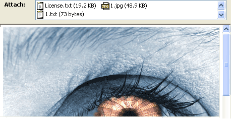
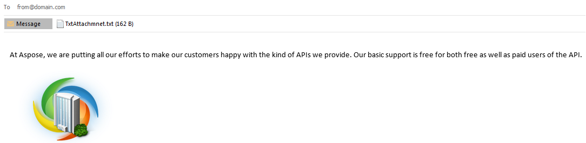

## **Working with Attachments**

**Email attachments** are files sent along with an email message. These files can include documents, images, archives, and more.

In Aspose.Email for C++, attachments are managed through the [Attachment](https://reference.aspose.com/email/cpp/class/aspose.email.attachment/) class, which works together with the [MailMessage](https://reference.aspose.com/email/cpp/class/aspose.email.mail_message/) class. You can add, remove, extract, or display attachments programmatically.

>**Note:** The maximum attachment size depends on the mail server (for example, Gmail limits attachments to 10 MB).

{}
**Try it out!**

Add or remove email attachments with the free [**Aspose.Email Editor App**](https://products.aspose.app/email/editor).
{}

### **Adding Attachments to an Email**

To attach one or more files to an email message, follow the steps below:

1. Create an instance of the [MailMessage](https://reference.aspose.com/email/cpp/class/aspose.email.mail_message/) class.
2. Create [Attachment](https://reference.aspose.com/email/cpp/class/aspose.email.attachment/) objects for each file.
3. Add the attachments to the message using `AddAttachment()`.
4. Save the message if needed.

**Code sample** 



### **Removing Attachments from an Email**

You can easily remove attachments from a message using the `Remove()` method of the [Attachments](https://reference.aspose.com/email/cpp/class/aspose.email.attachment_collection/) collection.

The following code snippet demonstrates how to remove an attachment:

1. Load or create a [MailMessage](https://reference.aspose.com/email/cpp/class/aspose.email.mail_message/) instance.
2. Add one or more attachments.
3. Remove the desired attachment.
4. Optionally, display remaining attachments.



### **Displaying Attachment File Names**

You can loop through all attachments and display their names on the console:



### **Extracting Attachments from an Email**

To extract and save attachments from an existing email file, follow the steps below:

1. Load the message using the [MailMessage](https://reference.aspose.com/email/cpp/class/aspose.email.mail_message/) class.
2. Loop through the [Attachments](https://reference.aspose.com/email/cpp/class/aspose.email.attachment_collection/) collection.
3. Save each attachment to disk and optionally display its name.

The following code snippet demonstrates how to extract email attachments:



|**Extracted attachments in email**|
| :- |
||

### **Reading Attachment Content Description**

Aspose.Email allows you to read an attachment’s **Content-Description** header for additional metadata.

**Code sample**



## **Working with Embedded Objects**

An **embedded object** is a file created in one application and enclosed within another document or email. For example, a Microsoft Excel spreadsheet can be embedded in a Word document, or an image can be embedded directly into an email body.

When an object is embedded (not just attached or linked), it retains its original format and can be opened or edited in its native application.

### **Embedding Objects into an Email**

To embed an image or other object in an email message, use the [LinkedResource](https://reference.aspose.com/email/cpp/class/aspose.email.linked_resource/) class together with the [MailMessage](https://reference.aspose.com/email/cpp/class/aspose.email.mail_message/) and [AlternateView](https://reference.aspose.com/email/cpp/class/aspose.email.alternate_view) classes. This allows you to include inline images or media content that appears directly in the message body.

The following code sample demonstrates how to create an email message with both plain text and HTML content that includes an embedded image:

1. Create an instance of the [MailMessage](https://reference.aspose.com/email/cpp/class/aspose.email.mail_message/) class.
2. Set the sender, recipient, and subject fields.
3. Create a plain-text body using [AlternateView](https://reference.aspose.com/email/cpp/class/aspose.email.alternate_view).
4. Create an HTML body containing a reference to the embedded object using the `cid` (Content-ID).
5. Create an instance of the [LinkedResource](https://reference.aspose.com/email/cpp/class/aspose.email.linked_resource/) class and load the object.
6. Assign a Content-ID to the linked resource.
7. Add the linked resource and alternate views to the message.
8. Save or send the email message.



> **Note:**
> You can embed multiple objects, but the maximum message size is limited by your mail server. For example, Gmail restricts message size to 10 MB.

### **Extracting Embedded Objects from an Email**

You can also extract embedded objects, such as images or files, from an existing email message. The process is similar to extracting attachments:

1. Create an instance of the [MailMessage](https://reference.aspose.com/email/cpp/class/aspose.email.mail_message/) class.
2. Load the email file into the [MailMessage](https://reference.aspose.com/email/cpp/class/aspose.email.mail_message/) instance.
3. Iterate through the attachments collection.
4. Save each embedded object to disk.
5. Optionally, display the file names in the console.



|**Extracted embedded objects in email**|
| :- |
||

