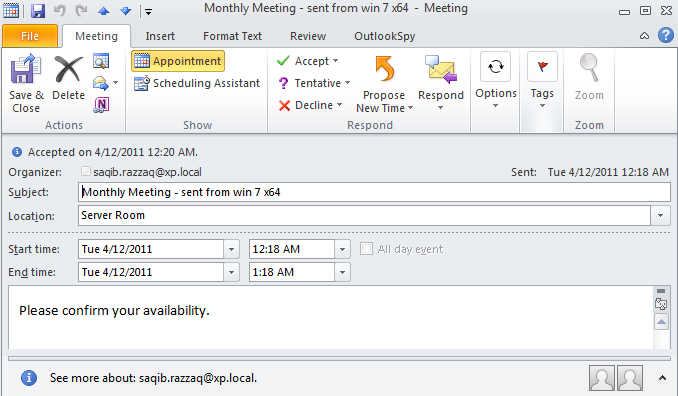

## **Adding MapiCalendar to PST**
Create a New PST File and Add Subfolders showed how to create a PST file and add a subfolder to it. With Aspose.Email you can add MapiCalendar to the Calendar subfolder of a PST file that you have created or loaded. Below are the steps to add MapiCalendar to a PST:

1. Create a MapiCalendar object.
1. Set the MapiCalendar properties using a constructor and methods.
1. Create a PST using the PersonalStorage.Create() method.
1. Create a pre-defined folder (Calendar) at the root of the PST file by accessing the root folder and then calling the AddMapiMessageItem() method.

The following code snippet shows you how to create a MapiCalendar and then add it to the calendar folder of a newly created PST file.


## **Save Calendar Items from PST to Disk in ICS Format**
This articles shows how to access calendar items from an Outlook PST file and save the calendar to disk in ICS format. Use the PersonalStorage and MapiCalendar classes to get the calendar information. Below are the steps to save calendar items :

1. Load the PST file in the PersonalStorage class.
1. Browse the Calendar folder.
1. Get the contents of the Calendar folder to get the message collection.
1. Loop through the message collection.
1. Call PersonalStorage.ExtractMessage() method to get the contact information in the MapiCalendar class.
1. Call the MapiCalendar.Save() method to save the calendar item to disk in ICS format.

The program below loads a PST file from disk and saves all the calendar items in ICS format. The ICS files can then be used in any other program that can load the standard ICS calendar file. Opened in Microsoft Outlook, an ICS file looks like the one in the below screenshot.

||
| :- |
The following code snippet shows you how to export the calendar items from Outlook PST to ICS format.


