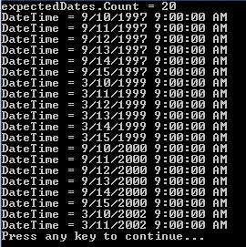

With Aspose.Email, it is possible to generate occurrences using a recurrence pattern. This article explains how, how to [generate the next occurrence](#calculate-the-next-occurrence-or-n-next-occurrences) and [get user friendly item descriptions](#get-user-friendly-text-for-a-recurrence). Occurrences from a MAPI calendar recurrence pattern can be generated using Aspose.Email. The following code snippet shows you how to generate occurrences from recurrence patterns.

## **Calculate the Next Occurrence or n Next Occurrences**
To get the "next" occurrence, use the GenerateOccurrences method with the parameter nNextOccurrences=1. The following code snippet shows you how to generates 20 occurrences by using nNextOccurrences = 20. The output of the code below is as follows:


## **Get User Friendly Text for a Recurrence**
User friendly text for a rule can be obtained using the FriendlyText property as shown below. The output of the code will be: "Recur every month on the 1st and 1st from end day(s) of the month for a maximum of 2 occurrences.". The following code snippet shows you how to get user friendly text for a recurrence.


