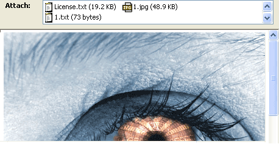
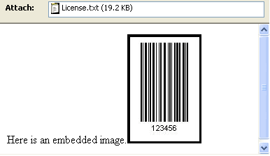

## **Managing Email Attachments**

An email attachment is a file that is sent along with an email message. The file may be sent as a separate message as well as a part of the message to which it is attached. The [Attachment](https://reference.aspose.com/email/net/aspose.email/attachment/) class is used with the [MailMessage](https://reference.aspose.com/email/net/aspose.email/mailmessage/) class. All messages include a body. In addition to the body, you might want to send additional files. These are sent as attachments and are represented as an instance of the [Attachment](https://reference.aspose.com/email/net/aspose.email/attachment/) class. You can send any number of attachments but the size of the attachment is limited by the mail server. Gmail, for example, does not support file sizes greater than 10MB.
{}
**Try it out!**

Add or remove email attachments online with the free [**Aspose.Email Editor App**](https://products.aspose.app/email/editor).
{}

### **Adding an Attachment**

To add an attachment to an email, please follow these steps:

1. Create an instance of the [MailMessage](https://reference.aspose.com/email/net/aspose.email/mailmessage/) class.
1. Create an instance of the [Attachment](https://reference.aspose.com/email/net/aspose.email/attachment/) class.
1. Load attachment into the [Attachment](https://reference.aspose.com/email/net/aspose.email/attachment/) instance.
1. Add the [Attachment](https://reference.aspose.com/email/net/aspose.email/attachment/) instance into the [MailMessage](https://reference.aspose.com/email/net/aspose.email/mailmessage/) instance.

The following code snippet shows you how to add an attachment to an email.

```csharp
// Create an instance of MailMessage class
var eml = new MailMessage
{
    From = "sender@from.com",
    To = "receiver@to.com",
    Subject = "This is message",
    Body = "This is body"
};

// Load an attachment
var attachment = new Attachment("1.txt");

// Add Multiple Attachment in instance of MailMessage class and Save message to disk
eml.Attachments.Add(attachment);

eml.AddAttachment(new Attachment("1.jpg"));
eml.AddAttachment(new Attachment("1.doc"));
eml.AddAttachment(new Attachment("1.rar"));
eml.AddAttachment(new Attachment("1.pdf"));
eml.Save("AddAttachments.eml");
```

Above, we described how to add attachments to your email message with Aspose.Email. What follows shows how to remove attachments, and display information about them on the screen.

### **Adding a Reference Attachment**

A reference attachment is a type of attachment that includes a link or a reference to a file or item, rather than including the file or item itself in the email message.
When the recipients of the email click on the reference attachment, they will be able to access the linked file if they have the appropriate permissions to do so.
By using a reference attachment, you can send a smaller email message and ensure that everyone has access to the most up-to-date version of the file or item.

The code snippet below shows how to add a reference attachment to an email. The code performs the following steps:

1. Loads the email message file using the [MailMessage.Load()](https://reference.aspose.com/email/net/aspose.email/mailmessage/load/#load_2) method.
2. Creates a new ReferenceAttachment object called refAttach, passing the attachment URL "https://[attach_uri]" as a parameter to its constructor.
3. Sets the name of the attachment to "Document.docx" using the [Name](https://reference.aspose.com/email/net/aspose.email/attachment/name/) property of the refAttach object.
4. Sets the provider type of the attachment to [AttachmentProviderType.OneDrivePro](https://reference.aspose.com/email/net/aspose.email/attachmentprovidertype/) using the [ProviderType](https://reference.aspose.com/email/net/aspose.email/referenceattachment/providertype/) property of the refAttach object.
5. Sets the permission type of the attachment to [AttachmentPermissionType.AnyoneCanEdit](https://reference.aspose.com/email/net/aspose.email/attachmentpermissiontype/) using the [PermissionType](https://reference.aspose.com/email/net/aspose.email/referenceattachment/permissiontype/) property of the refAttach object.
6. Adds the refAttach object to the [Attachments](https://reference.aspose.com/email/net/aspose.email/mailmessage/attachments/) collection of the eml object using the [Add()](https://reference.aspose.com/email/net/aspose.email/attachmentcollection/) method.

```cs
var eml = MailMessage.Load("fileName");

var refAttach = new ReferenceAttachment("https://[attach_uri]")
{
    Name = "Document.docx",
    ProviderType = AttachmentProviderType.OneDrivePro,
    PermissionType = AttachmentPermissionType.AnyoneCanEdit
};

eml.Attachments.Add(refAttach);
```

### **Removing an Attachment**

To remove an attachment, follow the steps given below:

- Create an instance of [Attachment](https://reference.aspose.com/email/net/aspose.email/attachment/) class.
- Load attachment in the instance of [Attachment](https://reference.aspose.com/email/net/aspose.email/attachment/) class.
- Add the attachment to the instance of [MailMessage](https://reference.aspose.com/email/net/aspose.email/mailmessage/) class.
- Remove the attachments from the instance of [Attachment](https://reference.aspose.com/email/net/aspose.email/attachment/) class using the [MailMessage](https://reference.aspose.com/email/net/aspose.email/mailmessage/) class instance.

The following code snippet shows you how to remove an attachment.

```csharp
// Create an instance of MailMessage class
var eml = new MailMessage {From = "sender@sender.com", To = "receiver@gmail.com"};

// Load an attachment
var attachment = new Attachment("1.txt");
eml.Attachments.Add(attachment);

// Remove attachment from your MailMessage
eml.Attachments.Remove(attachment);
```

### **Displaying Attachment File Name**

To display an attachment file name, follow these steps:

1. Loop through the attachments in the email message and save each attachment.
2. Display each attachment name on the screen.

The following code snippet shows you how to display an attachment file name on the screen.

```csharp
var eml = MailMessage.Load("Attachments.eml");

foreach (var attachment in eml.Attachments)
{
    // Display the the attachment file name
    Console.WriteLine(attachment.Name);
}
```

### **Extracting Email Attachments**

This topic explains how to extract an attachment from an email file. An email attachment is a file that is sent along with an email message. The file may be sent as a separate message as well as a part of the message to which it is attached. All email messages include an option to send additional files. These are sent as attachments and are represented as instances of the [Attachment](https://reference.aspose.com/email/net/aspose.email/attachment/) class. The [Attachment](https://reference.aspose.com/email/net/aspose.email/attachment/) class is used with the [MailMessage](https://reference.aspose.com/email/net/aspose.email/mailmessage/) class to work with attachments. To extract attachments from an email message, follow these steps:

- Create an instance of the [MailMessage](https://reference.aspose.com/email/net/aspose.email/mailmessage/) class.
- Load an email file into the [MailMessage](https://reference.aspose.com/email/net/aspose.email/mailmessage/) instance.
- Create an instance of the [Attachment](https://reference.aspose.com/email/net/aspose.email/attachment/) class and use it in a loop to extract all attachments.
- Save the attachment and display it on screen.

|**Extracted attachments in email**|
| :- |
||
The following code snippet shows you how to extract email attachments.

```csharp
var eml = MailMessage.Load("Message.eml", new MsgLoadOptions());

foreach (var attachment in eml.Attachments)
{
    attachment.Save("MessageEmbedded_out.eml");
    Console.WriteLine(attachment.Name);
}
```

#### **Retrieving Content-Description from Attachment**

Aspose.Email API provides the capability to read an attachment Content-Description from an attachment header. The following code snippet shows you how to retrieve the content description from the attachment.

```csharp
var eml = MailMessage.Load("EmailWithAttachEmbedded.eml");
Console.WriteLine(eml.Attachments[0].Headers["Content-Description"]);
```

#### **Determining if the Attachment is an Embedded Message**

The following code snippet demonstrates how to determine if the attachment is an embedded message or not.

```csharp
var eml = MailMessage.Load("EmailWithAttachEmbedded.eml");

Console.WriteLine(eml.Attachments[0].IsEmbeddedMessage
    ? "Attachment is an embedded message."
    : "Attachment isn't an embedded message.");
```

## **Working with inline images**

### **Add inline image to email body**

The [LinkedResource](https://reference.aspose.com/email/net/aspose.email/linkedresource/) class is used with the [MailMessage](https://reference.aspose.com/email/net/aspose.email/mailmessage/) class to embed objects in your email message. To add an embedded object, follow these steps

1. Create an instance of the [MailMessage](https://reference.aspose.com/email/net/aspose.email/mailmessage/) class.
1. Specify the from, to and subject values in [MailMessage](https://reference.aspose.com/email/net/aspose.email/mailmessage/) instance.
1. Create an instance of the [AlternateView](https://apireference.aspose.com/email/net/aspose.email/alternateview) class.
1. Create an instance of the [LinkedResource](https://reference.aspose.com/email/net/aspose.email/linkedresource/) class.
1. Load an embedded object into the [LinkedResourceCollection](https://reference.aspose.com/email/net/aspose.email/linkedresourcecollection/).
1. Add the loaded embedded object into the [MailMessage](https://reference.aspose.com/email/net/aspose.email/mailmessage/) class instance.
1. Add the [AlternateView](https://apireference.aspose.com/email/net/aspose.email/alternateview) instance to the [MailMessage](https://reference.aspose.com/email/net/aspose.email/mailmessage/) class instance.

The code snippets below produce an email message with both plain text and HTML bodies and an image embedded into the HTML

|**Image embedded into email**|
| :- |
||
You can send any number of embedded objects. The size of the attachment is limited by the mail server. Gmail, for example, does not support file sizes greater than 10MB. The code snippets below demonstrate how to embed objects into an Email.

```csharp
var eml = new MailMessage
{
    From = "AndrewIrwin@from.com",
    To = "SusanMarc@to.com",
    Subject = "This is an email"
};

// Create the plain text part It is viewable by those clients that don't support HTML
var plainView =
    AlternateView.CreateAlternateViewFromString("This is my plain text content", null, "text/plain");

// Create the HTML part.To embed images, we need to use the prefix 'cid' in the img src value.
// The cid value will map to the Content-Id of a Linked resource. Thus 
// will map to a LinkedResource with a ContentId of 'barcode'.
var htmlView =
    AlternateView.CreateAlternateViewFromString("Here is an embedded image.", null,
        "text/html");

// Create the LinkedResource (embedded image) and Add the LinkedResource to the appropriate view
var barcode = new LinkedResource("1.jpg", MediaTypeNames.Image.Jpeg)
{
    ContentId = "barcode"
};

eml.LinkedResources.Add(barcode);
eml.AlternateViews.Add(plainView);
eml.AlternateViews.Add(htmlView);

eml.Save("EmbeddedImage_out.msg", SaveOptions.DefaultMsgUnicode);
```

### **Remove inline image from email body**

[LinkedResourceCollection](https://reference.aspose.com/email/net/aspose.email/linkedresourcecollection/) accessed via [MailMessage.LinkedResources](https://reference.aspose.com/email/net/aspose.email/mailmessage/linkedresources/) property. The [LinkedResourceCollection](https://reference.aspose.com/email/net/aspose.email/linkedresourcecollection/) collection provides a method to completely remove embedded objects added into an email message. Use the overloaded version of [LinkedResourceCollection.RemoveAt](https://reference.aspose.com/email/net/aspose.email/linkedresourcecollection/removeat/#removeat/) method to remove all traces of an embedded object from an email message.

The sample code below shows how to remove embedded objects from an email message.

```csharp
//Load the test message with Linked Resources
var eml = MailMessage.Load("EmlWithLinkedResources.eml");

//Remove a LinkedResource
eml.LinkedResources.RemoveAt(0, true);

//Now clear the Alternate View for linked Resources
eml.AlternateViews[0].LinkedResources.Clear(true);
```
## **Working with Embedded Objects**

An embedded object is an object that was created with one application and enclosed within a document or a file created by another application. For example, a Microsoft Excel spreadsheet can be embedded into a Microsoft Word report, or a video file can be embedded into a Microsoft PowerPoint presentation. When a file is embedded, rather than inserted or pasted into another document, it retains its original format. The embedded document can be opened in the original application and modified.

### **Extracting Embedded Objects**

This topic explains how to extract embedded objects from an email file. The embedded document can be opened in the original application and be modified. To extract an embedded object from an email message, follow these steps:

1. Create an instance of the [MailMessage](https://reference.aspose.com/email/net/aspose.email/mailmessage/) class.
1. Load an email file in the [MailMessage](https://reference.aspose.com/email/net/aspose.email/mailmessage/) instance.
1. Create a loop and create an instance of the [Attachment](https://reference.aspose.com/email/net/aspose.email/attachment/) class in it.
1. Save the attachment and display it on screen.
1. Specify the sender and recipient address in the [MailMessage](https://reference.aspose.com/email/net/aspose.email/mailmessage/) instance.
1. Send email using the [SmtpClient](https://reference.aspose.com/email/net/aspose.email.clients.smtp/smtpclient/) class.

The code snippet below extracts embedded objects from an email.

|**Extracted embedded objects in email**|
| :- |
||
The following code snippet shows you how to extract embedded objects.

```csharp
var eml = MailMessage.Load("Message.msg", new MsgLoadOptions());

foreach (var attachment in eml.Attachments)
{
    attachment.Save("MessageEmbedded_out.msg");
    Console.WriteLine(attachment.Name);
}
```

#### **Identify and Extract an embedded attachment from MSG formatted as RTF**

For messages formatted as RTF, the following code can be used to differentiate and extract attachments that are either Inline or appear as Icon in the message body. The following code snippet shows you how to Identify and Extract an embedded attachment from MSG formatted as RTF.

```csharp

var eml = MapiMessage.Load("MSG file with RTF Formatting.msg");

foreach (var attachment in eml.Attachments)
{
    if (IsAttachmentInline(attachment))
    {
        try
        {
            SaveAttachment(attachment, Data.Out/new Guid().ToString());
        }
        catch (Exception ex)
        {
            Console.WriteLine(ex.Message);
        }
    }
}

static bool IsAttachmentInline(MapiAttachment attachment)
{
    foreach (var property in attachment.ObjectData.Properties.Values)
    {
        if (property.Name == "\x0003ObjInfo")
        {
            var odtPersist1 = BitConverter.ToUInt16(property.Data, 0);
            return (odtPersist1 & (1 << (7 - 1))) == 0;
        }
    }
    return false;
}

static void SaveAttachment(MapiAttachment attachment, string fileName)
{
    foreach (var property in attachment.ObjectData.Properties.Values)
    {
        if (property.Name == "Package")
        {
            using var fs = new FileStream(fileName, FileMode.Create, FileAccess.Write);
            fs.Write(property.Data, 0, property.Data.Length);
        }
    }
}
```

## **Retrieving Attachments from Signed Email**

Signed emails contain a single **smime.p7m** attachment. It means that the email is encrypted by SMIME. **Smime.p7m** file format is the digital signature. 
To see the contents of this email use the [RemoveSignature](https://reference.aspose.com/email/net/aspose.email/mailmessage/removesignature/) method. The method returns a [MailMessage](https://reference.aspose.com/email/net/aspose.email/mailmessage/) object without a digital signature.

```csharp
var signedEml = MailMessage.Load("signed.eml");
        
if (signedEml.IsSigned)
{
    for (var i = 0; i < signedEml.Attachments.Count; i++)
    {
        Console.WriteLine($@"Signed email attachment{i}: {signedEml.Attachments[i].Name}");
    }
    
    // The email is signed. Remove a signature.
    var eml = signedEml.RemoveSignature();
    
    Console.WriteLine(@"Signature removed.");

    for (var i = 0; i < eml.Attachments.Count; i++)
    {
        Console.WriteLine($@"Email attachment{i}: {eml.Attachments[i].Name}");
    }
}
```
