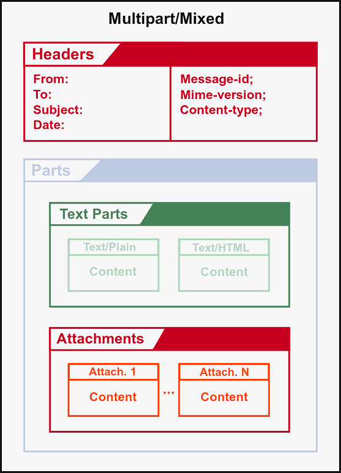
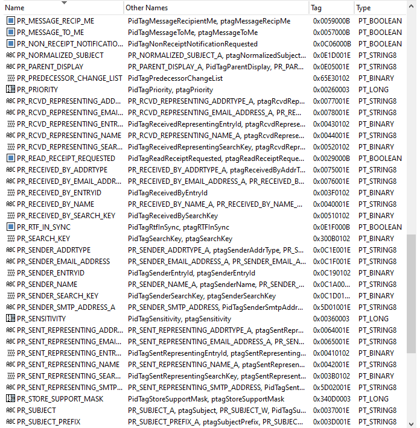
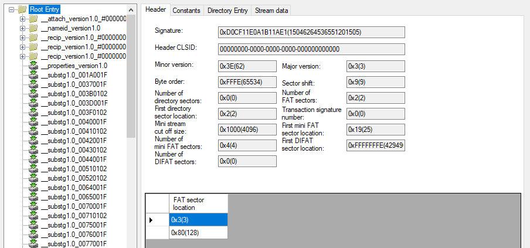

## **EML**

**EML** is one of the most widely recognized and utilized email file formats, primarily designed to adhere to the **MIME (Multipurpose Internet Mail Extensions)** standard. This format is widely supported across various email clients and systems owing to its open and generalized approach to email storage and transmission.

**Key Features:**

- Each EML file encapsulates a single email message along with its associated metadata such as sender, recipients, subject, and timestamps.
- EML files support rich formatting, attachments, and embedded elements, adhering to the MIME standard which allows for a versatile representation of email content.
- Unlike proprietary formats such as MSG (Microsoft Outlook Message), which are closely tied to specific software (Outlook and MAPI), EML files offer a more universal approach compatible with various email programs across different platforms. EML files are compatible with a multitude of email clients, including but not limited to Microsoft Outlook, Mozilla Thunderbird, Apple Mail, and many web-based email services.

The EML file format is inherently linked to the MIME standard, which is a specification for the format of Internet message bodies. MIME extends the basic email format to support text in character sets other than ASCII, as well as attachments of multimedia content.

**MIME Structure:**

- An EML file begins with the header section, containing information such as the From, To, Subject, Date, and other headers. Additional headers might include Content-Type, Content-Transfer-Encoding, and more.
- Following the headers, the body of an EML file is presented. This section can contain plain text, HTML, or multipart content allowing for the combination of different types of content within a single message.
- An EML file may include attachments encoded in base64, allowing binary data to be transferred via email. These attachments are defined within their own MIME parts with appropriate headers indicating the file type and encoding.

**MIME Types:**

The content of an EML file is broken down into various MIME types to differentiate text, HTML, and other media types. Common MIME types found within an EML file include:

- `text/plain` for plain text messages.
- `text/html` for HTML formatted messages.
- `multipart/mixed` for emails that include both message content and attachments.
- `application/octet-stream` for binary file attachments.

## **MSG**

**Microsoft Outlook Message (MSG)** is a proprietary email format used by Microsoft Outlook to store individual email messages. These files contain the email content and metadata such as sender, recipients, subject, and timestamps. They support rich formatting, attachments, and Outlook-specific features like flags, importance, and sensitivity.

**Key features:**

- MSG file represents a single email message.
- MSG files associate with Microsoft Outlook and can be opened by it.
- MSG files are commonly used for archiving, backup, and exchanging Outlook items between different instances of Outlook or other compliant email clients.

MSG is closely related within the context of Microsoft Outlook and **Messaging Application Programming Interface (MAPI)**. MAPI is a programming interface that allows applications to interact with messaging services, primarily Microsoft Exchange Server and Microsoft Outlook. It provides a set of functions and protocols for sending, receiving, and managing email messages, as well as accessing other messaging-related features such as calendars, contacts, and tasks. MAPI is used by Microsoft Outlook to create, manipulate, and manage email messages. When a user composes or receives an email in Outlook, MAPI handles the underlying communication with the mail server and provides the necessary functions for managing the message content.

**Technical Basis for MSG Format:**

MSG files store message data using **MAPI properties**, which are attributes that define various aspects of the message. These properties include standard attributes such as sender, recipient, subject, and timestamps, as well as custom properties and extended attributes.

Properties organize the message into a hierarchical structure, with top-level properties defining the overall message attributes and nested properties representing specific components such as recipients, attachments, and embedded objects. MSG files may contain multiple property streams, each containing a set of related MAPI properties.
These streams are structured according to the **Compound File Binary Format (CFBF)** and store both standard and custom properties.

## **OFT**

**Outlook File Template (OFT)** are email format used by Microsoft Outlook for creating standardized messages. Unlike MSG files, OFT files do not contain actual message content but serve as templates with predefined formatting, layout, and placeholders for dynamic content. 

**Key features:**

- OFT files streamline the creation of repetitive emails by providing pre-designed templates for common scenarios such as newsletters, announcements, or responses.
- By using OFT templates, organizations ensure consistency in branding, formatting, and messaging across all outgoing communications.
- Users can customize OFT templates by adding or modifying content before sending, allowing for personalized messages while maintaining standardized formatting.

## **TNEF**

**Transport Neutral Encapsulation Format (TNEF)** is a proprietary email format used by Microsoft Outlook and Microsoft Exchange Server to encapsulate email properties and rich text content that may not be supported by standard email protocols. 
It is used primarily by Microsoft email clients to encode and transmit rich text formatting, embedded objects, and other proprietary email features, ensuring that complex email content such as formatting, embedded files, and calendar events are preserved when emails are sent between different Microsoft email clients.

**Key Features:**

- TNEF can encapsulate a wide array of MAPI properties, a Microsoft-specific rich text formatting and special properties that can't be conveyed through standard MIME or plain text emails.
- Outlook items, such as Calendar, Contacts, Tasks, Notes can be encapsulated within the TNEF format.
- Non-Microsoft email clients might not understand or properly process TNEF attachments, often resulting in the annoying `winmail.dat` file. This usually happens because they can't decode the proprietary formatting encoded in TNEF.

**Technical Basis for TNEF Format:**

- TNEF encapsulates email content into a special binary attachment. This attachment typically carries a `.dat` file extension, most commonly named `winmail.dat`.
- TNEF data is often associated with the MIME type `application/ms-tnef`.
- TNEF format represents a hierarchy of message properties as a flat structure, which can be viewed as a sequential data stream. The typical format of a specific property in the stream includes an identifier with data type information, size (if not defined by the type), and data.

