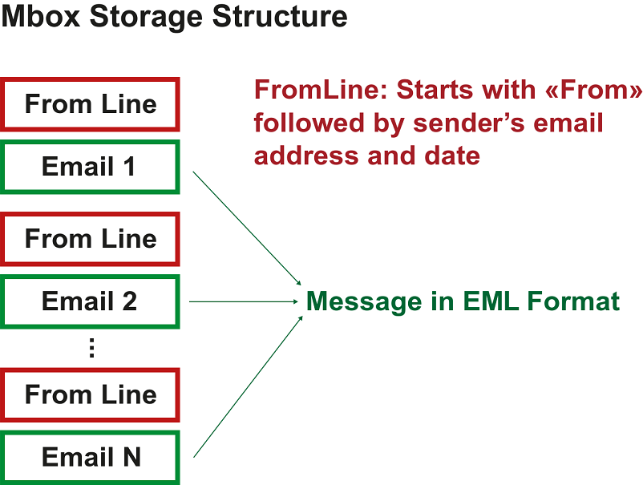

## **MBOX**

**MBOX (short for Mailbox)** is a widely used email storage format that has been prevalent for several decades. It is used to store a collection of email messages in a single file, with each message concatenated and demarcated by a separator line. 

MBOX was first developed in the 1970s and has since seen various versions and implementations over the years. It has been implemented in numerous email clients such as Unix mail, Mozilla Thunderbird, Eudora, and more.

### Key Features

- MBOX is supported across a wide range of platforms, including Unix, Linux, and macOS.
- Clients like Mozilla Thunderbird, Apple Mail, and many others can read and write MBOX files.
- The format's plain text nature makes it simple to parse and process using text-manipulation tools.
- Due to its simple structure, MBOX is popularly used for archiving and backup purposes.
- Since all emails are stored in a single file, the file can become quite large over time, leading to inefficiencies.

### Variants of MBOX

MBOX comes in several variants, each with slight differences in how they handle messages:

- **MBOXO:** The original format where "From " lines in the email body are quoted with a > character.
- **MBOXRD:** A variant of MBOXO that further extends the quoting method of "From " lines.
- **MBOXCL:** Introduced by the "Classic" MBOX variant where each "From " line is quoted with an ffrom string.
- **MBOXCL2:** A variation of MBOXCL where "From " lines are doubled to distinguish them.

### Technical Basis for MBOX Format

**File Structure:**

- An MBOX file is a plain text file that contains a series of EML messages.
- Each message starts with a "From " line (a space after the word "From") that typically includes the sender's email address and the timestamp when the message was received.
- Each message is followed by a blank line to separate it from the next message.


  
**Example:**

```
From user@example.com Fri Jan 01 00:00:00 2021
[Headers]
[Body]
From user2@example.com Fri Jan 01 00:01:00 2021
[Headers]
[Body]
```

## **PST/OST**

**Personal Storage Table (PST)** and **Offline Storage Table (OST)** are file formats used by Microsoft Outlook to store copies of emails, calendar events, and other items.

### Key Features

- PST files are used to store personal information and are typically used for archiving older emails and data. Primarily used by home users and small organizations for local storage of email messages, contacts, and calendar events.
- OST files are used for offline storage and synchronization of emails and other data with the Exchange server. Primarily used by users who access Microsoft Exchange Server or Office 365.
- Stored locally on a user's computer. Can be accessed even when the user is not connected to the email server.
- PST files can be easily backed up and transferred to other computers. Users can transfer PST files across different systems or Outlook versions.
- OST files are not intended for manual backup or transfer since they are synchronized copies of server data. OST files are tied to specific profiles and cannot be moved to different systems easily.

## **OLM**

**Outlook for Mac Archive File (OLM)** is a file format used by Microsoft Outlook for Mac to store email messages, calendar events, contacts, tasks, and other items.

### Key Features

- OLM files are primarily used for archiving and backing up emails and other Outlook items on Mac systems.
- OLM files are stored locally on the user's Mac.
- OLM files can be opened and accessed via Microsoft Outlook for Mac. They are not directly compatible with Outlook for Windows without conversion.
- There is no fixed size limit for OLM files imposed by Microsoft, but performance issues can occur if the file becomes very large. Users typically manage the size by creating multiple smaller archives rather than one large OLM file.
- Backup: Since OLM files are stored locally, they can be backed up or copied to external storage devices.

## **TGZ**

**TGZ**  (used by Zimbra for mailbox backup file) is a file format used for archiving and compressing data, commonly associated with Unix and Linux systems. The term "TGZ" refers to a combination of two utilities: "tar" (Tape Archive) and "gzip." The .tar file format bundles multiple files and directories into a single archive file. It preserves file system information such as directory structures, file permissions, and timestamps. The .gz file format compresses data, making the tar archive smaller and easier to manage or transfer. The compressed nature of TGZ makes it suitable for transferring email archives over the internet or moving them between systems.

## **NSF**

**Notes Storage Facility (NSF)** is a proprietary file format used primarily by IBM Lotus Notes (now HCL Notes) to store various types of data, including email, calendar events, tasks, and other application data. NSF files use a NoSQL, document-based database model. Each database is stored as a single NSF file with .nsf extension. The extension represents a database format used by IBM Notes and Domino Server. Each email, calendar entry, or task is stored as a document which can contain various types of data such as text, attachments, links, rich text formatting, and even metadata.
