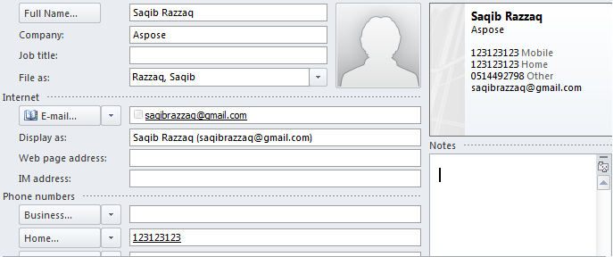

## **Adding Contact to PST**
Create a New PST File and Add Subfolders showed how to create a PST file and add a subfolder to it. With Aspose.Email you can add a MapiContact to the Contacts subfolder of a PST file that you have created or loaded. Below are the steps to add MapiContact to a PST:

1. Create a MapiContact object.
1. Set the MapiContact properties using different constructors and methods.
1. Create a PST using the PersonalStorage.create() method.
1. Create a pre-defined folder (Contacts) at the root of the PST file by accessing the root folder and then calling the add_mapi_message_item() method.

The following code snippet shows you how to create a MapiContact and then add it to the contacts folder of a newly created PST file.



## **Save contacts information from PST file in MSG Format**
This article explains how to access contact information from an Outlook PST file and save the contact to disk in MSG format. The PersonalStorage and MapiContact classes to get and display the contact information. The steps to get the contact information are:

1. Load the PST file in the PersonalStorage class.
1. Browse the Contacts folder.
1. Get the contents of the Contacts folder to get the message collection.
1. Loop through the message collection.
1. Call the PersonalStorage.extract_message() method to get the contact information in the MapiMessage class.
1. Call the MapiMessage.save() method to save the contact to disk in MSG format.

The following code snippet shows you how to retrieve all the contact information from the PST file and save to disk in MSG format.



## **Save Contacts information from PST file in VCF Format**
This article shows how to access contact information from a Microsoft Outlook PST file and save the contact to disk in vCard (VCF) format. Use the PersonalStorage and MapiContact classes to get contact information from the PST file. To get the contact information:

1. Load the PST file in the PersonalStorage class.
1. Browse the Contacts folder.
1. Get the contents of the Contacts folder to get the message collection.
1. Loop through the message collection.
1. Call the PersonalStorage.extract_message() method to get the contact information in the MapiContact class.
1. Use the MapiContact class different properties to access the contact information.

The program below loads a PST file from disk and saves all the contacts to vCard (VCF) format. The VCF files can then be used in any other program that can load the standard vCard contact file. If you open any VCF file in Microsoft Outlook, it looks like the one in the below screenshot.

||
| :- |
The following code snippet shows you how to export contacts from Outlook PST to vCard (VCF) format.


```py
from aspose.email.storage.pst import PersonalStorage
from aspose.email.mapi import ContactSaveFormat

# Load the Outlook PST file
pst = PersonalStorage.from_file("my.pst")

# Get the Contacts folder
folder_info = pst.root_folder.get_sub_folder("Contacts")

# Loop through all the contacts in this folder
message_info_collection = folder_info.get_contents()
for message_info in message_info_collection:
    # Get the contact information
    contact = pst.extract_message(message_info).to_mapi_message_item()

    # Display some contents on screen
    print("Name: " + contact.name_info.display_name + " - " + message_info.entry_id_string)

    # Save to disk in vCard VCF format
    contact.save("D:\\" + contact.name_info.display_name + ".vcf", ContactSaveFormat.V_CARD)
```
## **Working with Distribution Lists**
It is possible to create a Distribution list using Aspose.Email API that is a collection of multiple contacts. A distribution list can be saved to disc in Outlook MSG format and can be viewed/manipulated by opening it in MS Outlook.
### **Creating and Saving a Distribution List**
The following code snippet shows you how to create and save a distribution list.



### **Reading a Distribution List from a PST**
The following code snippet shows you how to read a distribution list from a PST.

```py
from aspose.email.mapi import MapiMessage

# Load the MAPI message from file
message = MapiMessage.load("dl.msg")

# Convert the message to MAPI distribution list
dlist = message.to_mapi_message_item()
```
