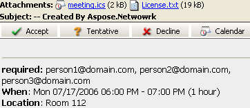

The [SmtpClient](https://reference.aspose.com/email/python-net/aspose.email.clients.smtp/smtpclient/#smtpclient-class) class in Aspose.Email for Python via .NET provides a robust and flexible interface for sending emails using the Simple Mail Transfer Protocol (SMTP). It is the primary entry point for developers who want to deliver email messages within their applications.

Key features of the [SmtpClient](https://reference.aspose.com/email/python-net/aspose.email.clients.smtp/smtpclient/#smtpclient-class) class include:

- **SMTP Email Delivery:** Enables sending emails directly through an SMTP server.

- **Alternative Delivery Options:** Supports additional delivery methods such as saving messages to the file system or writing to a message queue.

- **Synchronous and Asynchronous Operations:**

  - *Synchronous Mode*: Use Send methods to block the current thread until the email is fully transmitted.

  - *Asynchronous Mode*: Use SendAsync methods to send messages in the background, allowing the application to remain responsive.

- **TNEF Support:** Allows sending messages in Transport Neutral Encapsulation Format (TNEF) for compatibility with Microsoft Outlook features.

This article covers all major functionalities available through the [SmtpClient](https://reference.aspose.com/email/python-net/aspose.email.clients.smtp/smtpclient/#smtpclient-class) class, demonstrating how to send standard and advanced email messages with full control over configuration and delivery.

## **Send Emails Synchronously**

The [SmtpClient.send](https://reference.aspose.com/email/python-net/aspose.email.clients.smtp/smtpclient/#methods) method allows you to send an email message synchronously. This approach is useful when the application needs to confirm delivery before continuing.

To send a plain text email synchronously using Aspose.Email for Python via .NET, use the steps and the code sample below:

1. Create a [MailMessage](https://reference.aspose.com/email/python-net/aspose.email/mailmessage/) instance and set the sender, recipient(s), subject, and body.
2. Configure the [SmtpClient](https://reference.aspose.com/email/python-net/aspose.email.clients.smtp/smtpclient) with the server host, port, username, and password.
3. Call the `send` method on the [SmtpClient](https://reference.aspose.com/email/python-net/aspose.email.clients.smtp/smtpclient) instance and pass in the [MailMessage](https://reference.aspose.com/email/python-net/aspose.email/mailmessage/) object.


```py
# Create email
eml = ae.MailMessage()
eml.subject = "Message with Plain Text Body"
eml.body = "This is text body."
eml.from_address = "from@gmail.com"
eml.to.append(ae.MailAddress("to@gmail.com", "Recipient 1")) 

# Configure SmtpClient object
client = SmtpClient("smtp.gmail.com", 995, "username", "password")
client.security_options = SecurityOptions.AUTO 

# Send email
client.send(eml)
```

{} 

Sending emails asynchronously is not supported by the API.

{} 



## **Send a Pre-Composed EML File via SMTP**

If you need to send an email message that has already been composed and saved in EML format, you can load and send it programmatically using Aspose.Email for Python via .NET.

The following code snippet with steps demonstrates how to send an EML file using [SmtpClient](https://reference.aspose.com/email/python-net/aspose.email.clients.smtp/smtpclient/#smtpclient-class):

1. Load the EML file using the [MailMessage.load](https://reference.aspose.com/email/python-net/aspose.email/mailmessage/#methods) method.
2. Create and configure an instance of [SmtpClient](https://reference.aspose.com/email/python-net/aspose.email.clients.smtp/smtpclient/#smtpclient-class), providing the SMTP server host, username, and password for authentication.
3. Call the `send` method on the [SmtpClient](https://reference.aspose.com/email/python-net/aspose.email.clients.smtp/smtpclient/#smtpclient-class) instance and pass the loaded message.


```py
import aspose.email as ae

message = ae.MailMessage.load("test.eml")

# Send this message using SmtpClient
client = ae.clients.SmtpClient("host", "username", "password")
client.send(message)
```

## **Send a Plain Text Email**

You can send a plain text email using Aspose.Email by specifying the message body as simple text. The [MailMessage.body](https://reference.aspose.com/email/python-net/aspose.email/mailmessage/#properties) property is used to define the content, while the [SmtpClient](https://reference.aspose.com/email/python-net/aspose.email.clients.smtp/smtpclient/#smtpclient-class) class handles the sending process.

The following code snippet with steps demonstrate how to send a plain text email:

1. Create an instance of the [MailMessage](https://reference.aspose.com/email/python-net/aspose.email/mailmessage/#mailmessage-class) class.
2. Set the sender and recipient email addresses.
3. Assign the plain text content to the body property.
4. Create an instance of the [SmtpClient](https://reference.aspose.com/email/python-net/aspose.email.clients.smtp/smtpclient/#smtpclient-class) class with the server details and credentials.
5. Send the email using the `send` method.




## **Send HTML Email**

Aspose.Email for Python via .NET allows you to send emails with HTML-formatted bodies using the [MailMessage](https://reference.aspose.com/email/python-net/aspose.email/mailmessage/#mailmessage-class) class. By assigning HTML content to the `html_body` property and setting `is_body_html` to True, you can craft rich, styled messages.

The following code sample with steps demonstrate how to send an HTML email:

1. Create an instance of the [MailMessage](https://reference.aspose.com/email/python-net/aspose.email/mailmessage/#mailmessage-class) class.
2. Set the sender and recipient email addresses.
3. Set `is_body_html = True` to indicate HTML formatting.
4. Assign your HTML content to the `html_body` property.
5. Create and configure the [SmtpClient](https://reference.aspose.com/email/python-net/aspose.email.clients.smtp/smtpclient/#smtpclient-class) instance.
6. Use the `send` method to transmit the message.




>**Note:**
While this example uses basic HTML, you can incorporate more complex HTML structures to create responsive and branded email layouts.


## **Send HTML Email with Plain Text Alternative**

When sending HTML emails, it's best practice to include a plain text version for recipients whose email clients do not support HTML. Aspose.Email for Python via .NET offers the [AlternateView](https://reference.aspose.com/email/python-net/aspose.email/alternateview/) class to include both HTML and plain text content in a single message, enhancing compatibility and user experience.

The following code sample and steps demonstrate how to send an email with alternate text content:

1. Create an instance of the [MailMessage](https://reference.aspose.com/email/python-net/aspose.email/mailmessage/#mailmessage-class) class.
2. Set the sender and recipient email addresses.
3. Assign HTML content to the `html_body` property and set `is_body_html = True`.
4. Create a plain text AlternateView using [create_alternate_view_from_string](https://reference.aspose.com/email/python-net/aspose.email/alternateview/#methods).
5. Add the alternate view to the `alternate_views` collection of the [MailMessage](https://reference.aspose.com/email/python-net/aspose.email/mailmessage/#mailmessage-class).
6. Create and configure the [SmtpClient](https://reference.aspose.com/email/python-net/aspose.email.clients.smtp/smtpclient/#smtpclient-class) instance.
7. Send the email using the `send` method.




## **How to Send Bulk Emails**

Sending bulk emails involves dispatching multiple messages at once — each potentially addressed to a different recipient. Aspose.Email provides this capability using the [SmtpClient](https://reference.aspose.com/email/python-net/aspose.email.clients.smtp/smtpclient/#smtpclient-class) class. 

The code sample below demonstrates how to send a batch of emails in one go:

1. Create an instance of the [SmtpClient](https://reference.aspose.com/email/python-net/aspose.email.clients.smtp/smtpclient/#smtpclient-class) class and configure its host, port, credentials, and security settings.
2. Create multiple [MailMessage](https://reference.aspose.com/email/python-net/aspose.email/mailmessage/#mailmessage-class) instances — each representing an individual email message.
3. Specify sender, recipient, subject, and message body for each email.
4. Add all [MailMessage](https://reference.aspose.com/email/python-net/aspose.email/mailmessage/#mailmessage-class) objects to a [MailMessageCollection](https://reference.aspose.com/email/python-net/aspose.email/mailmessagecollection/).
5. Call the `send` method of the [SmtpClient](https://reference.aspose.com/email/python-net/aspose.email.clients.smtp/smtpclient/#smtpclient-class) class, passing the [MailMessageCollection](https://reference.aspose.com/email/python-net/aspose.email/mailmessagecollection/) as an argument.


```py
import aspose.email as ae
from aspose.email.clients import SmtpClient, SecurityOptions
from aspose.email import MailMessage, MailMessageCollection

# Create individual email messages
message1 = MailMessage("from@gmail.com", "to1@gmail.com", "Bulk Email - Message 1", "Hello, this is message 1.")
message2 = MailMessage("from@gmail.com", "to2@gmail.com", "Bulk Email - Message 2", "Hello, this is message 2.")
message3 = MailMessage("from@gmail.com", "to3@gmail.com", "Bulk Email - Message 3", "Hello, this is message 3.")

# Add messages to a collection
many_messages = MailMessageCollection()
many_messages.append(message1)
many_messages.append(message2)
many_messages.append(message3)

# Configure SMTP client
client = SmtpClient("smtp.gmail.com", 995, "username", "password")
client.security_options = SecurityOptions.AUTO

# Send all messages in bulk
client.send(many_messages)
```

## **Send Emails with Multi-Connection Support**

Aspose.Email for Python via .NET allows you to use multiple simultaneous connections when sending emails through the [SmtpClient](https://reference.aspose.com/email/python-net/aspose.email.clients.smtp/smtpclient/#smtpclient-class) class. This feature can help optimize performance when sending high volumes of email by distributing the workload across several connections. However, keep in mind that enabling multi-connection mode does not guarantee a performance boost in all scenarios — it depends on server configuration and network conditions.

**Key Properties:**

- `use_multi_connection`: Enables or disables multi-connection mode for the SMTP client.

- `connections_quantity`: Specifies the number of connections to open when multi-connection mode is enabled.

The following code sample shows how to enable multi-connection mode:

1. Create and configure an instance of [SmtpClient](https://reference.aspose.com/email/python-net/aspose.email.clients.smtp/smtpclient/#smtpclient-class).
2. Set server details such as host, port, username, password, and encryption.
3. Enable multi-connection mode by setting `use_multi_connection`.
4. Specify the number of connections with `connections_quantity`.


```py
import aspose.email as ae

client = ae.clients.smtp.SmtpClient
client.host = "<HOST>"
client.username = "<USERNAME>"
client.password = "<PASSWORD>"
client.port = 587
client.supported_encryption = ae.clients.base.EncryptionProtocols.TLS
client.security_options = ae.clients.SecurityOptions.SSL_EXPLICIT

client.connections_quantity = 5
client.use_multi_connection = ae.clients.MultiConnectionMode.ENABLE
client.send(messages)
```

## **Send TNEF-Formatted Emails**

Transport Neutral Encapsulation Format (TNEF) is a proprietary email format used by Microsoft Outlook and Exchange to preserve rich formatting, embedded objects, and special features like voting buttons. Standard email clients might not retain this formatting when using typical MIME-based messages.

Aspose.Email for Python via .NET supports sending emails in TNEF format to ensure that all advanced formatting and features are preserved. This is achieved by enabling the `use_tnef` property of the [SmtpClient](https://reference.aspose.com/email/python-net/aspose.email.clients.smtp/smtpclient/#smtpclient-class) class.

The following code sample and steps demonstrate how to send a TNEF email:

1. Load an existing EML message or create one using the [MailMessage](https://reference.aspose.com/email/python-net/aspose.email/mailmessage/#mailmessage-class) class.
2. Set the sender and recipient addresses.
3. Enable TNEF formatting by setting `use_tnef = True` on the [SmtpClient](https://reference.aspose.com/email/python-net/aspose.email.clients.smtp/smtpclient/#smtpclient-class) instance.
4. Send the message using the `send()` method.




## **Send Meeting Requests via Email**

Microsoft Outlook and other calendar-enabled email clients like IBM Lotus Notes allow users to manage appointments directly from their inbox. When a user receives a meeting invitation, they can accept or decline it directly within their email client. With Aspose.Email for Python via .NET, developers can programmatically create and send these meeting invitations in compliance with the iCalendar (RFC 2445) standard.

### **How to Send Meeting Invitations via Email**

Aspose.Email provides built-in support for composing and sending iCalendar meeting requests as part of an email. These requests are compatible with popular calendar clients and allow recipients to respond to invitations easily.

|**iCalendar meeting request sent by email**|
| :- |
||


The following code snippet shows you how to send requests via email:

1. Create a [MailMessage](https://reference.aspose.com/email/python-net/aspose.email/mailmessage/#mailmessage-class) instance.
2. Specify the sender and recipient email addresses.
3. Create an [Appointment](https://reference.aspose.com/email/python-net/aspose.email.calendar/appointment/) object with location, start/end times, sender, and recipients.
4. Set appointment summary and description.
5. Attach the appointment to the email using `add_alternate_view()`.
6. Send the email using the [SmtpClient](https://reference.aspose.com/email/python-net/aspose.email.clients.smtp/smtpclient/#smtpclient-class).



### **iCalendar Support for IBM Lotus Notes**

Aspose.Email uses the iCalendar format (RFC 2445), which ensures that your meeting requests are compatible with Microsoft Outlook, IBM Lotus Notes, and any other client that supports the standard. The same process can be used regardless of the recipient’s platform. 

## **Forward Emails using SMTP Client**

Forwarding emails is a common task in digital communication, often used to share received messages with others. Aspose.Email for Python via .NET allows developers to forward emails programmatically using the [SmtpClient](https://reference.aspose.com/email/python-net/aspose.email.clients.smtp/smtpclient/) class. The forward method enables forwarding saved or received email messages to new recipients without involving the original sender.

Below is a code sample that demonstrates how to forward an email using the [MailMessage](https://reference.aspose.com/email/python-net/aspose.email/mailmessage/#mailmessage-class) class:



### **Forward EML Files Without Loading into MailMessage**

Aspose.Email also supports forwarding .eml files directly without first loading them into a [MailMessage](https://reference.aspose.com/email/python-net/aspose.email/mailmessage/#mailmessage-class) object. This is particularly useful in scenarios where system memory usage needs to be minimized.

The code sample below demonstrates how to forward an EML file directly:  

```py
import aspose.email as ae

client = ae.clients.smtp.SmtpClient(host, smtp_port, username, password, ae.clients.SecurityOptions.AUTO)
file = open("test.eml", "rb")
client.forward(sender, recipients, file)
```
